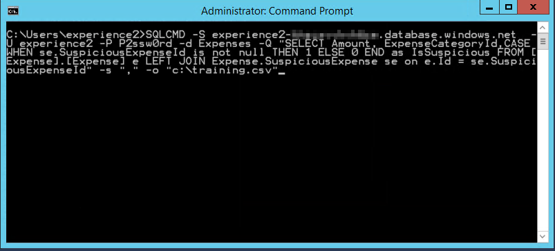
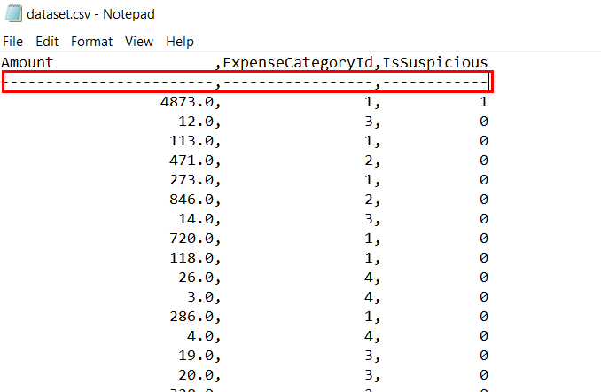

<page title="Creating the training dataset"/>

CREATING THE TRAINING DATASET
====

1. Open the SQL Server Management Studio:

	

2. Connect to the Azure SQL Server using the existing credentials

	

	And execute a query over the "Expenses" database:

	

3. So far, in MyExpenses we are using R Services inside SQL Server 2016 to find suspicious expenses in the system. Our machine learning model was created using the following Stored Procedure, named *TrainSuspiciousExpenseModel*, which we dropped when migrated to Azure SQL Database. Do not execute this, it just shows how the stored procedure looked like.

	```sql
	CREATE PROCEDURE [Expense].[TrainSuspiciousExpensesModel]
	AS
	BEGIN

	TRUNCATE TABLE [Expense].[PredictionModel]

	INSERT INTO [Expense].[PredictionModel]
	exec sp_execute_external_script  @language =N'R',    
	@script=N'
	model.tree <- rpart (IsSuspicious~.,data=InputDataSet,method="class")	
	trainedmodel<-data.frame(payload = as.raw(serialize(model.tree,connection=NULL)))
	OutputDataSet<-trainedmodel',      
	@input_data_1 =N'SELECT Amount, ExpenseCategoryId,
	CASE
		WHEN se.SuspiciousExpenseId is not null
		THEN 1
		ELSE 0
		END as IsSuspicious
	FROM [Expense].[Expense] e
	LEFT JOIN Expense.SuspiciousExpense se
	on e.Id = se.SuspiciousExpenseId'

	END
	```

4. This stored procedure, which we also dropped when migrated to Azure SQL Database, builds a new *classification* model using *Recursive partitioning and regression trees*. Once this is in place, another stored procedure on SQL Server 2016 is used to predict the *suspicious result*.  Do not execute this, it just shows how the stored procedure looked like.

	```sql
	CREATE PROCEDURE [Expense].EvaluateExpense 
	@ExpenseId NVARCHAR(50),
	@threshold float = 0.8
	AS
	BEGIN
	SET NOCOUNT ON;

	if not exists (select * from sysobjects where name='TemporalSuspiciousExpense' and xtype='U')
	CREATE TABLE TemporalSuspiciousExpense(id int,Amount float, ExpenseCategoryId int ,[no] float ,yes float)


	DECLARE @model varbinary(max) = (SELECT TOP 1 Model FROM Expense.PredictionModel);


	DECLARE @query nvarchar(500) = N'SELECT e.Id, e.Amount, e.ExpenseCategoryId FROM [Expense].[Expense] e WHERE e.Id = '+ @ExpenseId


	INSERT INTO TemporalSuspiciousExpense
	exec sp_execute_external_script  @language =N'R',    
	@script=N'
	model <- unserialize(model)
	test<-InputDataSet	
	pred.tree <- predict(model,test)
	output<-cbind(test,pred.tree)
	OutputDataSet<-cbind(test,pred.tree)',      
	@input_data_1 =@query,
	@params =N'@model varbinary(max)',
	@model = @model


	MERGE Expense.SuspiciousExpense as target
	USING(select Id from TemporalSuspiciousExpense WHERE yes > @threshold) as source
	ON (source.Id= target.SuspiciousExpenseId)
	WHEN NOT MATCHED THEN
		INSERT (SuspiciousExpenseId)
		VALUES (source.Id);


	DROP TABLE TemporalSuspiciousExpense

	SELECT CASE WHEN COUNT(*) > 0 THEN 1 ELSE 0 END AS IsSuspicious
	FROM Expense.SuspiciousExpense
	WHERE SuspiciousExpenseId = @ExpenseId

	END
	```

5. Now we'll use the same training data set in Azure ML Studio in order to create a new classification experiment. For this we have two different options:

	- Connect the experiment using SQL Azure
	- Create a *.csv* file with our training data and use it directly in Azure ML Studio

	We'll go with the second one. Open the command prompt and run the following SQL script to generate a *.csv* file with the training data:

	

	Copy the code below:

	```sql
	SQLCMD -S [databaseserver]  -U [user] -P [Password] -d Expenses -Q "SET NOCOUNT ON; SELECT Amount, ExpenseCategoryId,CASE WHEN se.SuspiciousExpenseId is not null THEN 1 ELSE 0 END as IsSuspicious FROM [Expense].[Expense] e LEFT JOIN Expense.SuspiciousExpense se on e.Id = se.SuspiciousExpenseId" -s "," -h -1 -o "c:\training.csv"
	```

	Past it into Notepad and make the following updates:

	- Replace [databaseserver] with your Azure SQL Server ({SERVERNAME}.database.windows.net)
	- Replace [user] with the default user (experience2)
	- Replace [password] with the default password (P2ssw0rd@Dev)
	
	You should have something like the following in your command prompt:

	

	Before importing it into AzureML, it is necessary to edit the dataset. Open it, and remove the second line of the file, which may cause some issues for the experiment:

	

	This dataset you've just created, with fields separated by commas, can be imported into *Azure ML Studio* using the *DataSet* section and the botton *add* toolbar, as seen in the following images.

	

	